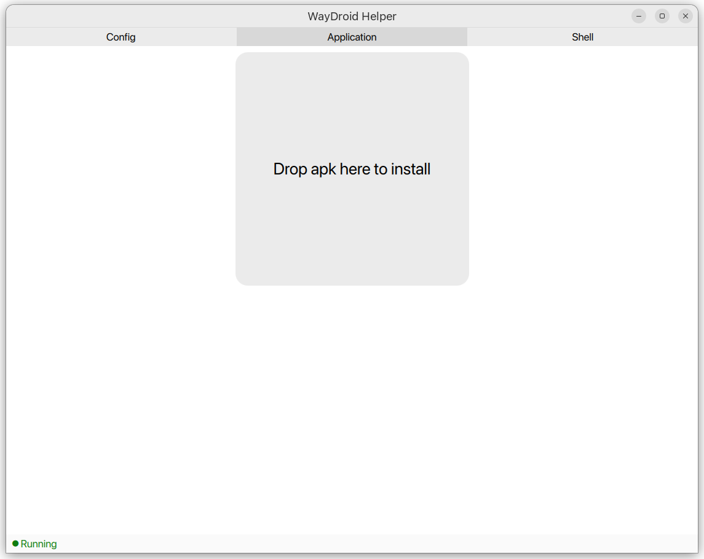

# WayDroid Helper

**This project is under development (or unfinished) and has many issues. Please feel free to report any bugs or feature requests.**

## Installation

```
pip install -r requirements.txt

# build qmltermwidget
cd ~
git clone --depth=1 https://github.com/ayasa520/qmltermwidget
cd qmltermwidget && qmake && make -j 
make install

ln -sf /usr/lib/qt/qml/QMLTermWidget $(python -m site --user-site)/PyQt5/Qt5/qml

# install waydroid-helper
cd ~
git clone --depth=1 https://github.com/ayasa520/waydroid-helper
cd waydroid-helper && make install
```


## Screenshots



## Credits

- [qmltermwidget](https://github.com/Swordfish90/qmltermwidget) The terminal widget for QTerminal