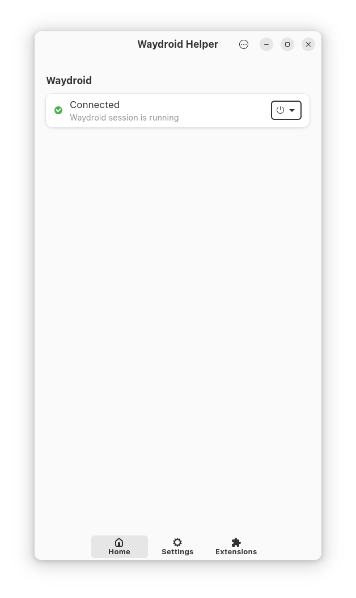
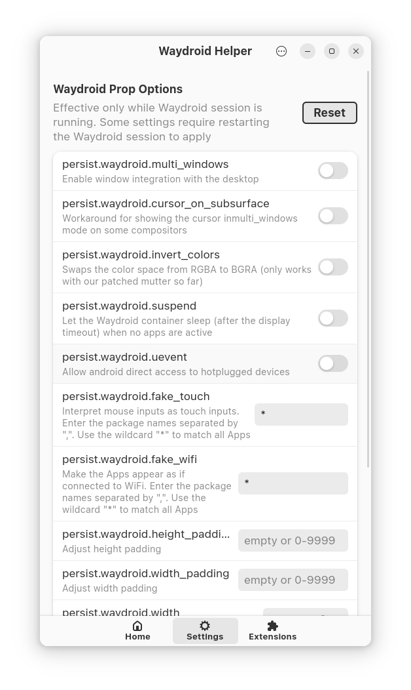
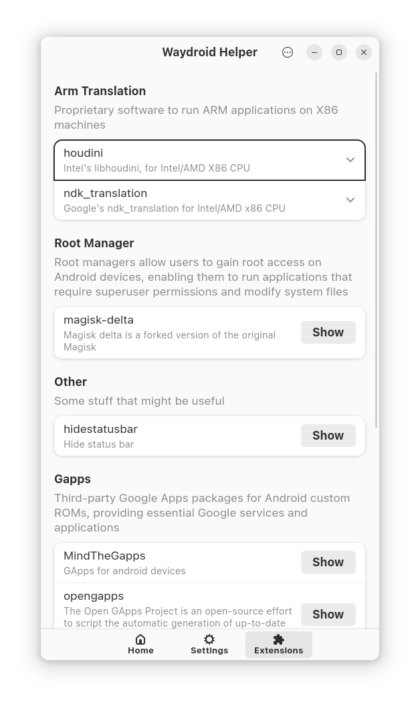

# Waydroid Helper

Waydroid Helper is a graphical user interface application written in Python using PyGObject. It provides a user-friendly way to configure Waydroid and install extensions, including Magisk and ARM translation.

## Features

- Configure Waydroid settings
- Install extensions for Waydroid
  - [Magisk](https://github.com/HuskyDG/magisk-files/)
  - [libhoudini](https://github.com/supremegamers/vendor_intel_proprietary_houdini)
  - [libndk](https://github.com/supremegamers/vendor_google_proprietary_ndk_translation-prebuilt)
  - [OpenGapps](https://sourceforge.net/projects/opengapps/)
  - [MindTheGapps](https://github.com/MindTheGapps)
  - [MicroG](https://microg.org/)
  - [SmartDock](https://github.com/axel358/smartdock)

## Installation

### Installing from Releases
1. Go to the [releases](https://github.com/ayasa520/waydroid-helper/releases) page
2. Download the appropriate package for your distribution
3. Install the package

### Arch

For Arch users, Waydroid Helper is available in the AUR:
```
yay -S waydroid-helper
```

### Debian

##### For **Debian Unstable** run the following:

```
echo 'deb http://download.opensuse.org/repositories/home:/CuteNeko:/waydroid-helper/Debian_Unstable/ /' | sudo tee /etc/apt/sources.list.d/home:CuteNeko:waydroid-helper.list
curl -fsSL https://download.opensuse.org/repositories/home:CuteNeko:waydroid-helper/Debian_Unstable/Release.key | gpg --dearmor | sudo tee /etc/apt/trusted.gpg.d/home_CuteNeko_waydroid-helper.gpg > /dev/null
sudo apt update
sudo apt install waydroid-helper
```

##### For **Debian Testing** run the following

```
echo 'deb http://download.opensuse.org/repositories/home:/CuteNeko:/waydroid-helper/Debian_Testing/ /' | sudo tee /etc/apt/sources.list.d/home:CuteNeko:waydroid-helper.list
curl -fsSL https://download.opensuse.org/repositories/home:CuteNeko:waydroid-helper/Debian_Testing/Release.key | gpg --dearmor | sudo tee /etc/apt/trusted.gpg.d/home_CuteNeko_waydroid-helper.gpg > /dev/null
sudo apt update
sudo apt install waydroid-helper
```

##### For **Debian 12** run the following:

```
echo 'deb http://download.opensuse.org/repositories/home:/CuteNeko:/waydroid-helper/Debian_12/ /' | sudo tee /etc/apt/sources.list.d/home:CuteNeko:waydroid-helper.list
curl -fsSL https://download.opensuse.org/repositories/home:CuteNeko:waydroid-helper/Debian_12/Release.key | gpg --dearmor | sudo tee /etc/apt/trusted.gpg.d/home_CuteNeko_waydroid-helper.gpg > /dev/null
sudo apt update
sudo apt install waydroid-helper
```

### Fedora

```
sudo dnf copr enable cuteneko/waydroid-helper
sudo dnf install waydroid-helper
```

### Ubuntu

```
sudo add-apt-repository ppa:ichigo666/ppa
sudo apt update
sudo apt install waydroid-helper
```

### Manual Build and Installation

For manual installation, you'll need to install the dependencies and build the project using Meson.

#### Arch, Manjaro and EndeavourOS based distributions
1. Install dependencies:

    ```bash
    sudo pacman -S gtk4 libadwaita meson ninja
    ```


2. Clone the repository:
    ```
    git clone https://github.com/ayasa520/waydroid-helper.git
    cd waydroid-helper
    ```
3. Build and install using Meson:
    ```
    python3 -m venv .venv
    source .venv/bin/activate
    pip install -r requirements.txt
    meson setup --prefix /usr build
    sudo ninja -C build install
    
    # Uninstall waydroid helper
    # sudo ninja -C build uninstall
    ```

#### Debian and Ubuntu based distributions
1. Install dependencies:

    ```bash
    sudo apt install libgtk-4-1 libgtk-4-dev libadwaita-1-dev libadwaita-1-0 libgirepository1.0-dev gcc libcairo2-dev pkg-config python3-dev gir1.2-gtk-4.0 gir1.2-adw-1 gettext ninja-build fakeroot attr libcap-dev libdbus-1-dev desktop-file-utils software-properties-common -y
    ```


2. Clone the repository:
    ```
    git clone https://github.com/ayasa520/waydroid-helper.git
    cd waydroid-helper
    ```
3. Build and install using Meson:
    ```
    python3 -m venv .venv
    source .venv/bin/activate
    pip install meson
    pip install -r requirements.txt
    meson setup --prefix /usr build
    sudo ninja -C build install
    
    # Uninstall waydroid helper
    # sudo ninja -C build uninstall
    ```

#### RHEL, Fedora and Rocky based distributions
1. Install dependencies:

    ```bash
    sudo dnf install gtk4 gtk4-devel libadwaita libadwaita-devel gobject-introspection-devel gcc cairo-devel pkgconf-pkg-config python3-devel gobject-introspection gtk4-devel libadwaita-devel gettext ninja-build fakeroot attr libcap-devel dbus-devel desktop-file-utils -y
    ```

2. Clone the repository:
    ```
    git clone https://github.com/ayasa520/waydroid-helper.git
    cd waydroid-helper
    ```
3. Build and install using Meson:
    ```
    python3 -m venv .venv
    source .venv/bin/activate
    pip install meson
    pip install -r requirements.txt
    meson setup --prefix /usr build
    sudo ninja -C build install
    
    # Uninstall waydroid helper
    # sudo ninja -C build uninstall
    ```

## Screenshots






## Troubleshooting

### Shared Folders not working
Enable systemd service
```
systemctl --user enable waydroid-monitor.service --now
```

For AppImage users, you need to manually copy the D-Bus configuration files and systemd unit files to their respective system locations to enable proper functionality. Here's the suggested file structure:

```
usr
├── lib
│   └── systemd
│       ├── system
│       │   └── waydroid-mount.service
│       └── user
│           └── waydroid-monitor.service
└── share
    ├── dbus-1
    │   ├── system.d
    │   │   └── id.waydro.Mount.conf
    │   └── system-services
    │       └── id.waydro.Mount.service

```


