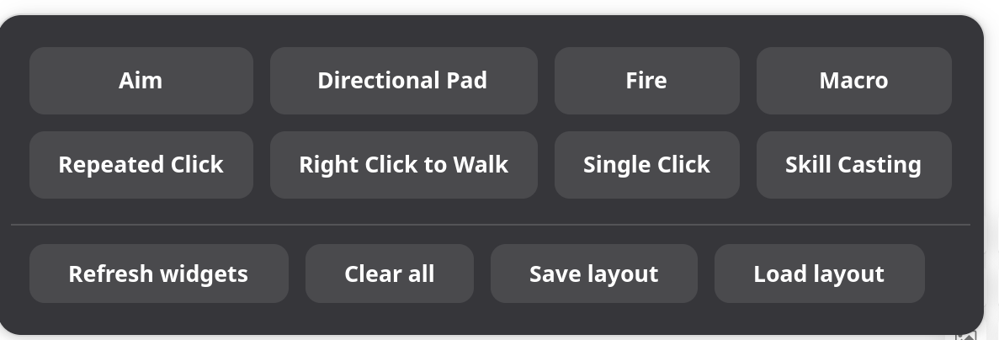
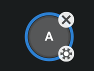
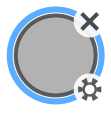
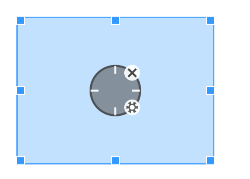
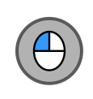
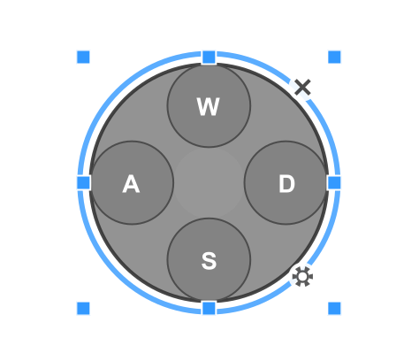
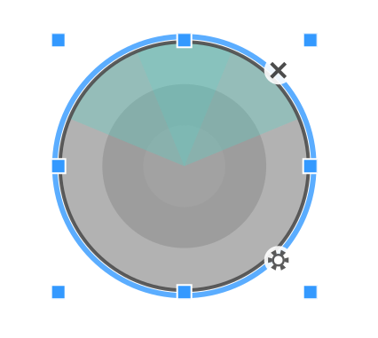
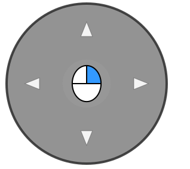

# Key Mapping Guide for Waydroid Helper

## Overview

The key mapping feature in Waydroid Helper allows you to create custom keyboard and mouse controls for Android applications running in Waydroid. This powerful system enables you to map physical keyboard keys and mouse buttons to touch screen interactions, making mobile games and apps more accessible on desktop systems.

## Getting Started

### Opening the Key Mapping Interface

1. Launch Waydroid Helper
2. Navigate to the **Home** tab
3. In the **Key Mapper** section, click the **Open** button
4. A transparent overlay window will appear over your screen

### Understanding the Two Modes

The key mapping interface operates in two distinct modes:

- **Edit Mode** (Default): Used for placing, configuring, and editing control widgets
- **Mapping Mode**: Used for actual gameplay with active key mappings

**Switch between modes**: Press `F1` to toggle between Edit Mode and Mapping Mode.

## Setting Up Key Mappings

### Adding Widgets



1. **Ensure you're in Edit Mode** (this is the default when opening)
2. **Right-click** on an empty area to open the widget selection panel
3. **Select a widget type** from the menu
4. **Position the widget** by dragging it to the desired location on your game interface
5. **Resize if needed** by dragging the resize handles when the widget is selected

### Configuring Key Bindings

1. **Double-click** on any widget to enter key capture mode
2. **Press the desired key(s)** you want to map to this widget
3. The widget will display the assigned key combination

#### Supported Key Types

- **Keyboard keys**: Letters, numbers, function keys, modifiers (Ctrl, Alt, Shift)
- **Mouse buttons**: Left, Right, Middle
- **Key combinations**: Multiple keys pressed together (e.g., Ctrl+A, Alt+Tab)

### Advanced Widget Configuration

Many widgets offer additional configurations through their setting panel:

1. **Select a widget** in Edit Mode
2. **Click the gear icon** in the widget's bottom-right corner
3. Adjust parameters

## Using Your Key Mappings

### Activating Mappings for Gameplay

1. **Switch to Mapping Mode** by pressing `F1`
2. **Position your game window** behind the transparent overlay
3. **Use your configured keys** to control the game
4. The overlay will show minimal visual indicators during gameplay

### Tips for Effective Usage

- Position widgets precisely over the corresponding game controls
- Use the resize handles to match widget sizes with in-game elements
- Switch back to Edit Mode (`F1`) anytime you need to make adjustments

## Available Control Widgets

### 1. Single Click



Maps a key/mouse button to a single tap at a specific screen location. Triggered when the physical button is pressed, release when it is released

- **Use Case**: Menu buttons, simple interactions
- **Configuration**: Position the widget over the target area and assign a key

### 2. Repeated Click



Automated rapid clicking

- **Use Case**: Auto-attack, rapid-fire actions
- **Operating Modes**:
  - **Long-press combo**: Continuous clicking while key is held
  - **Click after button**: Fixed number of clicks after click
- **Configuration**: Adjustable click rate and count

### 3. Aim



It is commonly used in FPS games. Adding it to the game can drag the position of the viewing angle, and cooperate with the fire button to realize the use of the mouse to move the viewing angle and aim and shoot. After adding, please drag the rectangular box to adjust the effective range of the viewing angle rotation, which needs to correspond to the effective range that can trigger the operation viewing angle rotation in the game.

- **Use Case**: Camera control and aiming
- **Special Features**: 
  - Works with Fire button for complete FPS control
- **Configuration**: Sensitivity

### 4. **Attack/fire**



Commonly used in FPS games, add a button to the position of the attack/fire button, and use the left button of the mouse to click, and it needs to be used with the aim button.

- **Use Case**: FPS games
- **Default Key**: Left Mouse Button
- **Special Feature**: 
  - Automatically activates when Aim widget is triggered
  - The key binding cannot be modified

### 5. Directional Pad (D-Pad)



Drag and position it on the virtual d-pad to control movement direction. After adding the button, drag the dotted border to resize it. Make sure the blue frame of the d-pad button matches the size of the in-game  virtual d-pad.

- **Use Case**: Character movement in games
- **Default Keys**: W (up), A (left), S (down), D (right)
- **Configuration**: 
  - Operation Modes:
    - **Slide control:** Simulates sliding from the center of the d-pad to trigger the movement
    - **Click control**


### 6. Skill Casting



Commonly used when using the characters' skills, click and cooperate with the mouse to release skills. Drag the dotted frame to resize the Skill Casting button to match the virtual skill button range.

- **Purpose**: Advanced skill targeting with mouse control
- **Use Case**: MOBA games
- **Configuration**
  - **Casting radius:** Fine-tune according to the casting range
  - **Casting timing**
    - On Release:  press and hold the button, release the button to cast
    - Immediate: press the button to cast immediately
    - Manual: Click once to simulate holding down the casting button, then click the button again to cast

  - **Cancel casting:** When enabled, a "cancel casting" button will be generated, drag the button to the cancel casting position. While casting a spell, hold down the cancel cast button to cancel the cast.


### 7. Right Click to Walk



Move it to the game's virtual joystick, use the mouse to control movement direction, and right-click on the screen to move to the specified location.

- **Use Case**: MOBA games
- **Default Keys**:  Right  Mouse Button

### 8. Macro Button

After adding a macro key, click the gear icon in its bottom-right corner to enter the settings interface.

- Supports common keyboard shortcuts for editing operations, such as Ctrl+A (Select All), Ctrl+V (Paste), Ctrl+X (Cut), Ctrl+Z (Undo), Ctrl+Y (Redo), etc.
- All commands must be in lowercase.
- When you click on the screen, the coordinates of the click will be automatically inserted into the textarea.

#### Trigger Timing Comman

**release_actions:** Each key operation has two states: **pressed (↓)** and **released (↑)**. A **holding state** can be achieved by combining these two states with proper commands.

By default, when a macro key is executed, commands trigger immediately upon key press. If certain commands need to trigger upon key release, add the **release_actions** command before those commands.

Example:

```
# Press and hold at coordinate (0,0) when macro key is pressed
# Release at coordinate (0,0) when macro key is released
press 0,0
release_actions
release 0,0
```

#### Single click Command

**click x1,y1 x2,y2...:** Click on coordinate points. Supports single-location clicks or simultaneous multi-touch by clicking multiple locations at once. Supports coordinate variables such as `mouse`. 

**Note:** For single click commands, the duration from press to release is fixed.

Example:

```
# Simultaneously click coordinates (0,0), (1,1), and current mouse position
## Wait 100ms, then click (2,2)
click 0,0 1,1 mouse
sleep 100
click 2,2
```

#### Hold and Release Commands

**press x1,y1 x2,y2...:** Press and hold coordinate points. Supports holding a single position or multiple positions simultaneously.

**release x1,y1 x2,y2...:** Release the hold state of coordinate points. Supports releasing one or multiple positions.

**switch x1,y1 x2,y2...:** Toggle between [Hold] and [Release] states for specified coordinate points.

All three commands above support coordinate variables such as `mouse`.

Examples:

```
# Press and hold (0,0) and (1,1) simultaneously, then release when macro key is released
press 0,0 1,1
release_actions
release 0,0 1,1

# Toggle (0,0) touch state - switches state each time the macro key is pressed
switch 0,0
```

**key_press a:** Simulate pressing a keyboard key.

**key_release a:** Simulate releasing a keyboard key.

**key_switch a:** Toggle the pressed/released state of a keyboard key.

The above three commands can call other keys nested within them (these keys must already be bound to widgets). Macro keys can also call other macro keys.

Examples:

```
# Simulate pressing [A] when macro key is held, release [A] when macro key is released
key_press a
release_actions
key_release a

# Toggle [A] key state with each macro key press
key_switch a
```

#### Wait Command

**sleep duration:** Waits for a specified period of time before continuing execution.

Example:

```
# Click (0,0), wait 1 second, then click (1,1)
click 0,0
sleep 1000
click 1,1
```

#### Aim Command

Achieves a Genshin Impact PC-like effect where holding a key unlocks the mouse cursor, and releasing the key returns to locked mouse mode.

Example:

```
exit_staring
release_actions
sleep 50  
enter_staring
```

#### D-pad Radius Toggle

Allows real-time switching of d-pad radius. In games like Sky: Children of the Light and Farlight 84, this enables toggling between walk/run speeds.

**swipehold_radius x:** Adjusts the d-pad radius to x times its original size.

**swipehold_radius_switch x:** Toggles the d-pad radius between x times the original size and 1x (normal size).


Example:

```
# Walk when pressed, run when released
swipehold_radius 0.2
release_actions
swipehold_radius 1
```

```
# Toggle between walking and running with each press
swipehold_radius_switch 0.5
```

