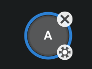
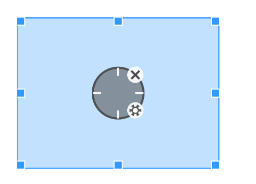
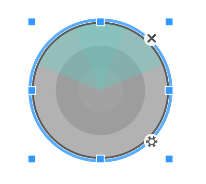

# Waydroid Helper 按键映射指南

## 概述

Waydroid Helper 的按键映射功能允许您为在 Waydroid 中运行的 Android 应用程序创建自定义的键盘和鼠标控制。这个强大的系统使您能够将物理键盘按键和鼠标按钮映射到触摸屏交互，让移动游戏和应用在桌面系统上更易于使用。

## 快速开始

### 打开按键映射界面

1. 启动 Waydroid Helper
2. 导航到**主页**选项卡
3. 在**按键映射器**部分，点击**打开**按钮
4. 屏幕上将出现一个透明的覆盖窗口

### 理解两种模式

按键映射界面有两种不同的模式：

- **编辑模式**（默认）：用于放置、配置和编辑控制组件
- **映射模式**：用于实际游戏，激活按键映射

**模式切换**：按 `F1` 键在编辑模式和映射模式之间切换。

## 设置按键映射

### 添加组件


1. 确保处于编辑模式（打开时的默认模式）
2. 在空白区域右键点击，打开组件选择面板
3. 从菜单中选择所需的组件类型
4. 将组件拖动到游戏界面上的合适位置
5. 如有需要，选中组件后拖动调整手柄来改变大小

### 配置按键绑定

1. 双击任何组件进入按键捕获模式
2. 按下想要映射到此组件的按键
3. 组件将显示分配的按键组合

#### 支持的按键类型

- **键盘按键**：字母、数字、功能键、修饰键（Ctrl、Alt、Shift）
- **鼠标按钮**：左键、右键、中键
- **按键组合**：同时按下的多个按键（例如 Ctrl+A、Alt+Tab）

### 高级组件配置

许多组件通过其设置面板提供额外的配置选项：

1. 在编辑模式下选择组件
2. 点击组件右下角的齿轮图标
3. 调整相关参数

## 使用按键映射

### 激活映射进行游戏

1. 按 `F1`切换到映射模式
2. 把透明窗口放置在 Waydroid 上方
3. 使用配置的按键控制游戏
4. 游戏运行时，覆盖层将显示最简洁的视觉指示

### 有效使用技巧

- 精确定位组件在游戏控件对应位置
- 使用调整手柄匹配组件大小与游戏内元素
- 随时切换回编辑模式（`F1`）进行调整

## 可用控制组件

### 1. 单击



将按键/鼠标按钮映射到特定屏幕位置的单击。物理按钮按下时触发，释放时释放

- **使用场景**：菜单按钮、简单交互
- **配置**：将组件放置在目标区域上并分配按键

### 2. 连续点击


自动快速点击

- **使用场景**：自动攻击、连发动作
- **操作模式**：
  - **长按组合**：按住按键时持续点击
  - **按键后点击**：按键释放后固定次数点击
- **配置**：可调节点击速率和次数

### 3. 瞄准



常用于 FPS 游戏。添加后可用于拖动视角位置，配合开火按钮实现使用鼠标移动视角、瞄准和射击。添加后请拖动矩形框调整视角旋转的有效范围，需要对应游戏中可触发操作视角旋转的有效范围。

- **使用场景**：相机控制和瞄准
- **特殊功能**：
  - 与开火按钮配合实现完整 FPS 控制
- **配置**：灵敏度

### 4. **攻击/开火**


常用于 FPS 游戏，在攻击/开火按钮位置添加按钮，使用鼠标左键点击，需要与瞄准按钮配合使用。

- **使用场景**：FPS 游戏
- **默认按键**：鼠标左键
- **特殊功能**：
  - 瞄准组件触发时自动激活
  - 按键绑定无法修改

### 5. 方向键（D-Pad）


拖动并定位在虚拟方向键上以控制移动方向。添加按钮后，拖动虚线边框调整大小。确保方向键按钮的蓝色框架与游戏中虚拟方向键的大小匹配。

- **使用场景**：游戏中的角色移动
- **默认按键**：W（上）、A（左）、S（下）、D（右）
- **配置**：
  - 操作模式：
    - **滑动控制**：模拟从方向键中心滑动以触发移动
    - **点击控制**

### 6. 技能释放



常用于使用角色技能时，点击并与鼠标配合释放技能。拖动虚线框架调整技能释放按钮大小以匹配虚拟技能按钮范围。

- **用途**：带鼠标控制的高级技能瞄准
- **使用场景**：MOBA 游戏
- **配置**
  - **释放半径**：根据释放范围微调
  - **释放时机**
    - 松开：按住按钮，释放按钮时释放
    - 立即：按下按钮立即释放
    - 手动：点击一次模拟按住释放按钮，再次点击按钮释放

  - **取消释放**：启用时，将生成"取消释放"按钮，拖动按钮到取消释放位置。释放法术时，按住取消释放按钮取消释放。

### 7. 右键行走


将右键行走按钮移动到游戏的虚拟摇杆上，使用鼠标控制移动方向，右键点击屏幕移动到指定位置。

- **使用场景**：MOBA 游戏
- **默认按键**：鼠标右键

### 8. 宏按钮

添加宏按钮后，点击其右下角的齿轮图标进入设置界面。

- 支持常用键盘快捷键进行编辑操作，如 Ctrl+A（全选）、Ctrl+V（粘贴）、Ctrl+X（剪切）、Ctrl+Z（撤销）、Ctrl+Y（重做）等。
- 所有命令必须为小写。
- 点击屏幕时，点击的坐标将自动插入到文本区域。

#### 触发时机命令

**release_actions:** 每个按键操作有两个状态：**按下（↓）** 和 **释放（↑）**

默认情况下，宏按钮执行时，命令在按键按下时立即触发。如果某些命令需要在按键释放时触发，在这些命令前添加 **release_actions** 命令。

示例：

```
# 宏按钮按下时在坐标 (0,0) 按下并保持
# 宏按钮释放时在坐标 (0,0) 释放
press 0,0
release_actions
release 0,0
```

#### 单击命令

**click x1,y1 x2,y2...:** 点击坐标点。支持单位置点击或通过同时点击多个位置实现多点触控。支持坐标变量如 `mouse`。

**注意：** 对于单击命令，从按下到释放的持续时间固定。

示例：

```
# 同时点击坐标 (0,0)、(1,1) 和当前鼠标位置
# 等待 100ms，然后点击 (2,2)
click 0,0 1,1 mouse
sleep 100
click 2,2
```

#### 按住和释放命令

**press x1,y1 x2,y2...:** 按住坐标点。支持按住单个位置或多个位置同时。

**release x1,y1 x2,y2...:** 释放坐标点的按住状态。支持释放一个或多个位置。

**switch x1,y1 x2,y2...:** 切换指定坐标点的[按住]和[释放]状态。

以上三个命令都支持坐标变量如 `mouse`。

示例：

```
# 同时按住 (0,0) 和 (1,1)，宏按钮释放时释放
press 0,0 1,1
release_actions
release 0,0 1,1

# 切换 (0,0) 触摸状态 - 每次宏按钮按下时切换状态
switch 0,0
```

**key_press a:** 模拟按下键盘按键。

**key_release a:** 模拟释放键盘按键。

**key_switch a:** 切换键盘按键的按下/释放状态。

以上三个命令可以嵌套调用其他键（这些键必须已绑定到组件）。宏按钮也可以调用其他宏按钮。

示例：

```
# 宏按钮按住时模拟按下 [A]，宏按钮释放时释放 [A]
key_press a
release_actions
key_release a

# 每次宏按钮按下时切换 [A] 键状态
key_switch a
```

#### 等待命令

**sleep duration:** 等待指定时间后继续执行。

示例：

```
# 点击 (0,0)，等待 1 秒，然后点击 (1,1)
click 0,0
sleep 1000
click 1,1
```

#### 瞄准命令

实现类原神端游的效果，按住某个键解锁鼠标，松开键则回到锁定鼠标模式

```
exit_staring
release_actions
sleep 50
enter_staring
```


#### 方向按键半径切换

允许实时切换方向按键半径。在《光遇》和《萤火突击》等游戏中，可以实现行走/奔跑速度之间的切换。

**swipehold_radius x：** 将虚半径调整为原本的 x 倍。

**swipehold_radius_switch x：** 在原本的 x 倍半径与 1 倍（正常大小）之间切换半径。

示例:

```
# 按下时行走，释放时奔跑
swipehold_radius 0.2
release_actions
swipehold_radius 1
```

```
# 每次按下在行走与奔跑之间切换
swipehold_radius_switch 0.5
```


